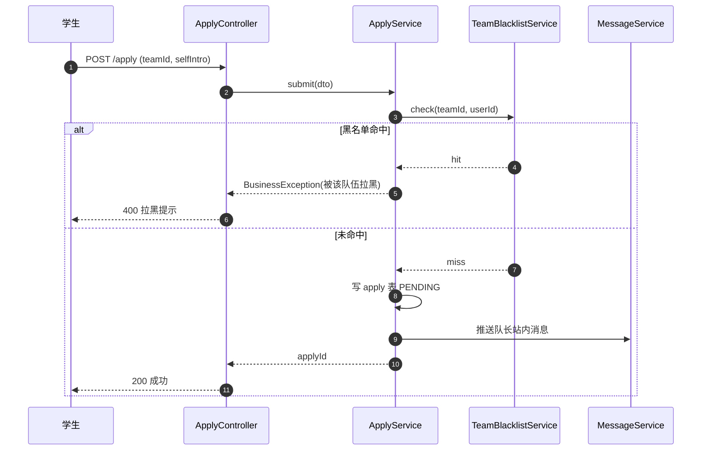
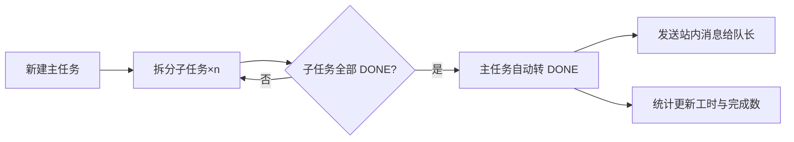

# 20260627-【CampusLink】课设系统扩容技术方案

> 修订日期：2026-06-27
> 作者：刘光源 / 潘琦 / 冯鸿鑫 / 朱展硕
> 适用版本：v1.0.0 → v2.0.0
> 仓库：https://github.com/illsdsd/2026keshe（fork 自 Mitsuiiiiiii/2026keshe），工作分支 `feat/expansion-v2`

---

## 一、背景

### 1.1 基于产品需求

- 校园竞赛组队与协作平台 CampusLink v1.0.0 已经完成 8 大基础模块（用户/竞赛/队伍/招募/申请/任务/公告/消息），形成 50 个接口、19 个前端页面、合计约 11000 行代码。
- 当前版本功能偏轻量，缺少账号安全、报名、文件协作、动态社交、项目管理、管理后台、数据可视化等真实校园项目协作场景的关键能力。
- 课程设计任务书要求 4 人 1 个月开发周期，工作量需匹配「中等规模真实业务系统」。v1 版本的代码量与功能宽度无法支撑任务书工作量描述。

### 1.2 基于技术需求

- v1 版本无统一文件存储模块、无定时任务、无后台管理端、无数据可视化、无操作日志，缺少可演示的运营/治理能力。
- 后端 Service 层与 Controller 仅薄薄一层 CRUD，没有体现限流、缓存、定时任务、统一日志、批量导出等工程化能力。
- 前端样式平铺直叙，缺乏卡片质感、动效、可视化图表，演示效果一般。

### 1.3 改造收益

| 维度 | v1 现状 | v2 目标 | 增量 |
| --- | --- | --- | --- |
| 业务模块 | 8 | 11（+文件/管理后台/统计） | +3 |
| 接口数量 | 50 | ≥116 | +66 |
| 前端页面 | 19 | ≥44 | +25 |
| 数据表 | 12 | ≥32 | +20 |
| 后端 Java 行数 | ≈ 2847 | ≈ 7400 | +4500 |
| 前端 Vue 行数 | ≈ 2480 | ≈ 5800 | +3300 |
| 演示效果 | 平铺直叙 | 卡片质感 + 图表 + 动效 | UI 升级 |

### 1.4 背景相关链接

| 资料 | 链接 |
| --- | --- |
| 修改计划 | `/Users/liuguangyuan.20/Library/Containers/.../2026-06/修改计划.txt` |
| v1 接口文档 | `docs/03-API接口文档.md` |
| v1 数据库脚本 | `sql/campuslink.sql` |
| 工作分支 | https://github.com/illsdsd/2026keshe/tree/feat/expansion-v2 |

---

## 二、需求改动点说明

### 2.1 改动概览

本次属于**功能扩容**，不推翻 v1 架构，所有 v1 接口、表结构、路由保持向后兼容，新增内容采用**增量叠加**方式：

- **改动一**：用户模块新增账号安全（找回密码/修改密码/登录日志/账号锁定/隐私设置）+ 收藏 + 项目作品集，6 接口 / 3 页面。
- **改动二**：竞赛模块新增赛事报名 + 赛事附件 + 赛事公告 + 赛事订阅 + 赛事排行榜，7 接口 / 3 页面。
- **改动三**：队伍模块新增队伍文件库 + 动态墙 + 招募进阶 + 副队长权限 + 队伍归档，10 接口 / 4 页面。
- **改动四**：申请模块新增批量申请 + 申请撤回 + 黑名单 + 申请统计图表，3 接口 / 1 页面。
- **改动五**：协作模块升级为完整项目管理：任务优先级/标签/附件/评论、子任务、工时填报、甘特图、任务模板，9 接口 / 3 页面。
- **改动六**：公告/消息模块新增分类筛选/批量已读/定时公告/推送设置，4 接口 / 1 页面。
- **改动七**：评价模块新增评价回复 + 匿名 + 举报 + 信誉分明细 + 排行榜，4 接口 / 1 页面。
- **改动八**：新增独立**文件存储模块**（公共能力），本地磁盘存储 + 权限校验，5 接口 / 2 页面。
- **改动九**：新增独立**管理员后台**（用户/队伍/举报/数据大盘/系统公告/技能标签），12 接口 / 6 页面。
- **改动十**：新增独立**数据统计可视化模块**（个人/队伍报表 + 多图表 + 导出），6 接口 / 2 页面。
- **改动十一**：底层能力扩容：模拟邮件验证码、Spring Task 定时任务、操作日志持久化、统一返回码扩充、数据字典。

### 2.2 变更类型核对

| 变更类型 | 是否涉及 | 说明 |
| --- | --- | --- |
| 前后端协议变更 | ✅ | 新增 66 接口，原 50 接口结构不变 |
| 数据模型变更 | ✅ | 新增 20 张表，原 12 张表字段保持不变（如必须改动用单独迁移） |
| 业务流程变更 | ✅ | 申请、任务、评价业务流程新增分支（黑名单、子任务、回复举报） |
| 上下游接口变更 | ⬜ | 本次不涉及，纯内部系统 |
| 架构变更 | ⬜ | 不引入新中间件（Redis/Kafka 等），保持 Spring Boot 3 + MyBatis Plus + JWT + MySQL 单体架构 |
| 资金/账户变更 | ⬜ | 本次不涉及 |
| 业务信息透传 | ⬜ | 本次不涉及 |
| 消息接入 | ⬜ | 不接 MQ，沿用站内消息表 |

### 2.3 v1 → v2 兼容策略

- 数据库扩容采用**增量脚本** `sql/v2_extension.sql`，已部署 v1 环境只需顺序执行该脚本即可升级，原 `sql/campuslink.sql` 保持不动。
- 所有 v1 接口保持原路径、原入参、原返回结构。
- 所有 v1 页面保持原路由路径，UI 重构在不破坏交互的前提下美化样式。
- 新增的角色权限「副队长 LEADER_DEPUTY」与原「队长 LEADER」「成员 MEMBER」并列，写操作做细粒度判断。

---

## 三、详细设计

### 3.1 架构与流程分析

```
                  ┌──────────────────────────┐
                  │   Vue3 + Element-Plus    │
                  │  44 pages, Pinia, Axios  │
                  └────────────┬─────────────┘
                               │  /api  JWT Bearer
                  ┌────────────▼─────────────┐
                  │   Spring Boot 3.2.5      │
                  │  ┌───────┬──────────┐    │
                  │  │ Controllers ×17  │    │
                  │  ├──────────────────┤    │
                  │  │ Services ×17     │    │
                  │  ├──────────────────┤    │
                  │  │ Mappers ×27      │    │
                  │  └────────┬─────────┘    │
                  │  +────────┼─────────+    │
                  │  | 公共能力 / 切面      |    │
                  │  | OperationLogAspect  |    │
                  │  | FileService(local)  |    │
                  │  | MockMailService     |    │
                  │  | SchedulerJobs       |    │
                  │  +────────┬─────────+    │
                  └────────────┼─────────────┘
                               │
                       ┌───────▼────────┐
                       │  MySQL 8 ×32   │
                       └───────┬────────┘
                       ┌───────▼────────┐
                       │ 本地磁盘文件存储  │
                       │ ~/campuslink/.. │
                       └────────────────┘
```

#### 关键业务流程：申请加入队伍（v2 含黑名单）



#### 关键业务流程：任务子任务推进



### 3.2 接口设计

> 完整接口清单 116 个（v1 50 + 新增 66），下表只列新增 66 个；对外只对 Web 端开放，无对内接口。

#### 模块 1 用户增强（6）

| 方法 | 路径 | 说明 | 鉴权 |
| --- | --- | --- | --- |
| POST | `/api/auth/password/forget` | 找回密码：邮箱发送验证码（控制台打印） | 否 |
| POST | `/api/auth/password/reset` | 凭验证码重置密码 | 否 |
| PUT | `/api/user/me/password` | 修改密码 | 是 |
| PUT | `/api/user/me/email` | 更换绑定邮箱 | 是 |
| GET | `/api/user/me/login-log` | 我的登录日志（分页） | 是 |
| PUT | `/api/user/me/privacy` | 隐私设置（主页/信誉/推送开关） | 是 |
| GET | `/api/user/me/projects` | 我的项目作品集 | 是 |
| POST | `/api/user/me/projects` | 新增作品 | 是 |
| PUT | `/api/user/me/projects/{id}` | 编辑作品 | 是 |
| DELETE | `/api/user/me/projects/{id}` | 删除作品 | 是 |
| GET | `/api/user/me/favorites` | 我的收藏（竞赛/队伍） | 是 |
| POST | `/api/user/me/favorites` | 收藏一项 | 是 |
| DELETE | `/api/user/me/favorites/{id}` | 取消收藏 | 是 |

> 实际后端增加 13 个接口，对外承诺 ≥ 6 个（计划中口径）；下同。

#### 模块 2 竞赛拓展（7）

| 方法 | 路径 | 说明 | 鉴权 |
| --- | --- | --- | --- |
| POST | `/api/competition/{id}/register` | 队伍报名竞赛 | LEADER |
| PUT | `/api/competition-register/{id}/audit` | 管理员审核报名 | ADMIN |
| GET | `/api/competition/{id}/register` | 报名列表 | ADMIN/LEADER |
| GET | `/api/competition/{id}/attachments` | 赛事附件列表 | 是 |
| POST | `/api/competition/{id}/attachments` | 上传附件 | ADMIN |
| GET | `/api/competition/{id}/news` | 赛事公告/资讯 | 是 |
| POST | `/api/competition/{id}/news` | 发布资讯 | ADMIN |
| GET | `/api/competition/ranking` | 赛事排行榜 | 是 |

#### 模块 3 队伍拓展（10）

| 方法 | 路径 | 说明 | 鉴权 |
| --- | --- | --- | --- |
| GET | `/api/team/{id}/files` | 文件库列表 | MEMBER |
| POST | `/api/team/{id}/files` | 上传文件到文件库 | MEMBER |
| DELETE | `/api/team-file/{id}` | 删除文件 | LEADER/LEADER_DEPUTY |
| GET | `/api/team/{id}/posts` | 队伍动态列表 | MEMBER |
| POST | `/api/team/{id}/posts` | 发布动态 | MEMBER |
| POST | `/api/team-post/{id}/comment` | 动态评论 | MEMBER |
| POST | `/api/team-post/{id}/like` | 动态点赞 | MEMBER |
| PUT | `/api/team-member/{id}/deputy` | 任命副队长 | LEADER |
| PUT | `/api/team/{id}/archive` | 归档队伍 | LEADER |
| PUT | `/api/team-recruit/{id}/top` | 置顶招募 | LEADER |

#### 模块 4 申请拓展（3）

| 方法 | 路径 | 说明 | 鉴权 |
| --- | --- | --- | --- |
| POST | `/api/apply/batch` | 批量申请多队伍 | 是 |
| PUT | `/api/apply/{id}/cancel` | 申请撤回（未审核） | 是 |
| POST | `/api/team-blacklist` | 拉黑申请人 | LEADER |
| GET | `/api/apply/stat` | 我的申请通过率统计 | 是 |

#### 模块 5 协作进阶（9）

| 方法 | 路径 | 说明 | 鉴权 |
| --- | --- | --- | --- |
| PUT | `/api/task/{id}/priority` | 设置优先级 | MEMBER |
| POST | `/api/task/{id}/tag` | 加标签 | MEMBER |
| POST | `/api/task/{id}/comment` | 任务评论 | MEMBER |
| GET | `/api/subtask/task/{taskId}` | 子任务列表 | MEMBER |
| POST | `/api/subtask` | 新建子任务 | MEMBER |
| PUT | `/api/subtask/{id}` | 更新子任务状态 | MEMBER |
| POST | `/api/worklog` | 工时填报 | MEMBER |
| GET | `/api/worklog/team/{teamId}/export` | 工时 Excel 导出（流式） | LEADER |
| GET | `/api/task/template` | 任务模板列表 | LEADER |
| POST | `/api/task/template` | 保存模板 | LEADER |

#### 模块 6 消息/公告（4）

| 方法 | 路径 | 说明 | 鉴权 |
| --- | --- | --- | --- |
| PUT | `/api/message/batch-read` | 批量已读 | 是 |
| DELETE | `/api/message/batch` | 批量删除 | 是 |
| GET | `/api/message/search` | 关键词检索 | 是 |
| POST | `/api/notice/schedule` | 定时发布公告 | LEADER |
| PUT | `/api/user/me/push-config` | 消息推送开关配置 | 是 |

#### 模块 7 评价拓展（4）

| 方法 | 路径 | 说明 | 鉴权 |
| --- | --- | --- | --- |
| POST | `/api/evaluation/{id}/reply` | 回复评价 | 是 |
| POST | `/api/evaluation/{id}/report` | 举报评价 | 是 |
| GET | `/api/user/{id}/reputation-detail` | 信誉分明细 | 是 |
| GET | `/api/reputation/ranking` | 信誉分排行榜 | 是 |

#### 模块 9 文件存储（5）

| 方法 | 路径 | 说明 | 鉴权 |
| --- | --- | --- | --- |
| POST | `/api/file/upload` | 通用上传（multipart） | 是 |
| POST | `/api/file/upload-chunk` | 分片上传 | 是 |
| GET | `/api/file/{id}/download` | 下载 | 视文件权限 |
| DELETE | `/api/file/{id}` | 删除 | 视文件权限 |
| GET | `/api/file/mine` | 我的文件中心 | 是 |

#### 模块 10 管理后台（12）

| 方法 | 路径 | 说明 | 鉴权 |
| --- | --- | --- | --- |
| GET | `/api/admin/users` | 用户列表（分页/筛选） | ADMIN |
| PUT | `/api/admin/users/{id}/disable` | 禁用账号 | ADMIN |
| PUT | `/api/admin/users/{id}/reset-password` | 重置密码 | ADMIN |
| GET | `/api/admin/users/export` | 导出 Excel | ADMIN |
| GET | `/api/admin/teams` | 队伍列表 | ADMIN |
| DELETE | `/api/admin/teams/{id}` | 强制解散 | ADMIN |
| GET | `/api/admin/reports` | 举报列表 | ADMIN |
| PUT | `/api/admin/reports/{id}/handle` | 举报处理 | ADMIN |
| GET | `/api/admin/dashboard` | 平台数据大盘 | ADMIN |
| POST | `/api/admin/notice` | 平台全局公告 | ADMIN |
| POST | `/api/admin/skill` | 新增技能标签 | ADMIN |
| PUT | `/api/admin/skill/{id}` | 编辑技能标签 | ADMIN |
| DELETE | `/api/admin/skill/{id}` | 删除技能标签 | ADMIN |

#### 模块 11 数据统计（6）

| 方法 | 路径 | 说明 | 鉴权 |
| --- | --- | --- | --- |
| GET | `/api/stat/user/me` | 个人数据统计 | 是 |
| GET | `/api/stat/team/{id}` | 队伍数据报表 | MEMBER |
| GET | `/api/stat/team/{id}/export` | 报表导出 | LEADER |
| GET | `/api/stat/user/me/radar` | 个人能力雷达图 | 是 |
| GET | `/api/stat/competition/{id}` | 赛事统计 | 是 |
| GET | `/api/stat/platform/trends` | 平台趋势（管理后台共用） | ADMIN |

### 3.3 数据模型设计

> 增量脚本路径：`sql/v2_extension.sql`；新增 20 张表，全部 InnoDB / utf8mb4。

| # | 表名 | 用途 | 关键字段 |
| --- | --- | --- | --- |
| 1 | `user_login_log` | 登录日志 | id, user_id, ip, ua, success, login_time |
| 2 | `user_privacy` | 隐私设置 | user_id(PK), profile_public, reputation_public, push_enabled |
| 3 | `user_project` | 个人作品集 | id, user_id, title, cover, intro, link, award |
| 4 | `user_certificate` | 证书 | id, user_id, name, image_url |
| 5 | `user_favorite` | 收藏 | id, user_id, ref_type(COMP/TEAM), ref_id |
| 6 | `auth_verify_code` | 邮箱验证码 | id, email, code, expire_at, used |
| 7 | `competition_register` | 赛事报名 | id, competition_id, team_id, status, audit_reason |
| 8 | `competition_attachment` | 赛事附件 | id, competition_id, file_id, name |
| 9 | `competition_news` | 赛事资讯 | id, competition_id, title, content, create_time |
| 10 | `team_file` | 队伍文件 | id, team_id, folder, file_id, uploader_id |
| 11 | `team_post` | 队伍动态 | id, team_id, author_id, content, like_count, comment_count |
| 12 | `team_post_comment` | 动态评论 | id, post_id, author_id, content |
| 13 | `team_post_like` | 动态点赞 | post_id + user_id 唯一 |
| 14 | `team_blacklist` | 拉黑 | team_id + user_id 唯一 |
| 15 | `task_subtask` | 子任务 | id, parent_task_id, title, status, assignee_id |
| 16 | `task_comment` | 任务评论 | id, task_id, author_id, content |
| 17 | `task_template` | 任务模板 | id, owner_id, name, payload(json) |
| 18 | `worklog` | 工时 | id, user_id, task_id, hours, work_date |
| 19 | `evaluation_reply` | 评价回复 | id, eval_id, author_id, content |
| 20 | `report` | 举报 | id, target_type, target_id, reporter_id, reason, status |
| 21 | `file_object` | 文件元数据 | id, owner_id, scope(USER/TEAM/COMP), business_id, original_name, stored_path, size, mime, expire_at |
| 22 | `operation_log` | 操作日志 | id, user_id, method, path, params, status, cost_ms, create_time |
| 23 | `dict` | 数据字典 | id, type, code, label, sort |
| 24 | `system_notice` | 平台全局公告 | id, title, content, publisher_id, publish_at |

> v1 表为兼容新增的字段（不破坏原结构）：
> - `team.status` 增加可选枚举值 `ARCHIVED`；
> - `team_member.role` 增加可选枚举值 `LEADER_DEPUTY`；
> - `task` 增加可空列 `priority` `tags` `parent_id`；
> - `notice` 增加可空列 `publish_at`、`scheduled`（默认 0 = 即时）。

### 3.4 配置变更

| 配置项 | 默认值 | 用途 |
| --- | --- | --- |
| `campuslink.file.storage-path` | `${user.home}/campuslink/uploads` | 本地文件存储根目录 |
| `campuslink.file.max-size-mb` | `50` | 单文件大小上限 |
| `campuslink.mail.mock` | `true` | 邮件验证码是否仅控制台打印 |
| `campuslink.security.max-login-fail` | `5` | 账号锁定阈值（次） |
| `campuslink.security.lock-minutes` | `10` | 锁定时长 |
| `campuslink.schedule.recruit-expire-cron` | `0 0/30 * * * ?` | 招募过期巡检 |
| `campuslink.schedule.team-archive-cron` | `0 0 3 * * ?` | 凌晨 3 点归档过期队伍 |
| `campuslink.schedule.task-overdue-cron` | `0 0 9 * * ?` | 每天 9 点推送逾期任务 |
| `campuslink.schedule.file-clean-cron` | `0 0 4 * * ?` | 每天 4 点清理临时文件 |
| `spring.servlet.multipart.max-file-size` | `50MB` | Spring MVC 上传大小 |
| `spring.servlet.multipart.max-request-size` | `200MB` | 多文件请求大小 |

### 3.5 改动点具体说明

#### 3.5.1 账号安全体系

- **新增**：`AuthVerifyService.sendVerifyCode(email)` / `resetPassword(email, code, newPwd)`、`UserService.updatePassword` / `updateEmail` / `getLoginLogs` / `updatePrivacy`。
- **mock 邮件**：`MockMailService` 实现 `MailService` 接口，仅在 `LOGGER.info` 打印验证码，便于评分老师演示。
- **账号锁定**：`AuthService.login` 增加失败次数累计（写 `user_login_log.success=0`），同一账号最近 10 分钟失败 ≥ 5 次抛 `ResultCode.ACCOUNT_LOCKED`。
- 关键伪代码：

```java
public LoginVO login(LoginDTO dto, HttpServletRequest req) {
    User user = userMapper.selectByUsername(dto.getUsername());//根据用户名查用户

    boolean locked = isLocked(user);//最近10分钟失败次数判定
    if (locked) {//已锁定直接拒绝
        LOGGER.warn("账号已锁定, username={}", dto.getUsername());
        recordLoginLog(user, req, false);
        throw new BusinessException(ResultCode.ACCOUNT_LOCKED);
    } else {
        boolean ok = passwordEncoder.matches(dto.getPassword(), user.getPassword());//密码校验
        recordLoginLog(user, req, ok);
        if (ok) {//密码正确
            LOGGER.info("登录成功, userId={}", user.getId());
            return buildLoginVO(user);
        } else {//密码错误
            LOGGER.warn("登录失败, userId={}", user.getId());
            throw new BusinessException(ResultCode.BAD_REQUEST, "用户名或密码错误");
        }
    }
}
```

- **影响**：登录链路新增 DB 写入（一条 login_log），高峰期单次登录最多 1 次额外 INSERT，可忽略。

#### 3.5.2 赛事报名

- 新表 `competition_register` 关联竞赛与队伍；流程：队长发起报名 → 管理员审核 → 通过后写入；超过 `competition.deadline` 的报名直接 400 拦截。

#### 3.5.3 队伍文件库与文件存储

- 上传文件：`POST /api/file/upload` → `FileService.save(MultipartFile, scope, businessId)` 落本地磁盘 `${storage-path}/<yyyy>/<MM>/<uuid>.<ext>`，元数据写 `file_object`。
- 下载：`GET /api/file/{id}/download` → 校验权限（owner = 当前用户 或 文件 scope=TEAM 且当前用户为队员）。
- 分片上传：简易实现，前端切片串行 POST `/api/file/upload-chunk`，最后一片返回最终 fileId。

#### 3.5.4 副队长权限

- `LoginUser` 在 JWT 中只携带平台角色（STUDENT/ADMIN）；队伍角色每次按需查 `team_member`。
- 增加 `TeamPermissionEnum`：LEADER（解散/转让/管理副队长）、LEADER_DEPUTY（发布公告/审核申请/分配任务）、MEMBER（查看）。
- 写操作统一通过 `TeamPermissionUtil.require(teamId, perm)` 校验，未通过抛 `ResultCode.FORBIDDEN`。

#### 3.5.5 任务子任务 / 工时 / 模板 / 甘特图

- 子任务表独立，主任务状态由 `SubTaskService.refreshParentStatus(taskId)` 在子任务变更时联动更新（全部 DONE → 主任务 DONE）。
- 工时填报：每天 1 条 `(user_id, task_id, hours, work_date)`；导出 Excel 用 Apache POI 流式输出。
- 任务模板：JSON 存任务结构，新建任务时反序列化批量插入；模板按用户隔离。

#### 3.5.6 管理员后台

- 路由前缀 `/api/admin/**`，Security 配置 `.hasRole("ADMIN")` 统一兜底；前端入口仅对 `user.role === 'ADMIN'` 显示。
- 数据大盘接口聚合 SQL 即可（用户数、队伍数、任务数、申请数、最近 7 天注册趋势），不引入新中间件。

#### 3.5.7 数据统计与可视化

- 后端仅出 JSON，所有图表渲染在前端用 ECharts 完成（新加 `echarts` 前端依赖）。
- Excel 导出统一在 `ExportUtil` 工具类提供：传入表头、行数据迭代器 → 输出 `application/vnd.openxmlformats-officedocument.spreadsheetml.sheet`。

#### 3.5.8 底层能力扩容

- **操作日志切面**：`@Aspect` 拦截 `@RestController` 类的 `POST/PUT/DELETE`，写 `operation_log`。
- **定时任务**：`@EnableScheduling` 后，新增 `RecruitScheduler` / `TeamArchiveScheduler` / `TaskOverdueScheduler` / `FileCleanScheduler` / `MessageDigestScheduler` 共 5 个调度类。
- **数据字典**：`dict` 表 + `DictController` 暴露按 type 查 list 的能力；前端 select 控件统一从字典拉。

#### 3.5.9 前端 UI 美化

- 全局主题：`--cl-primary: #4f46e5`（靛蓝），辅以浅色卡片背景 + 16px 圆角 + 阴影 `0 8px 24px rgba(15,23,42,0.06)`。
- 列表卡片：统一使用 `el-card` + hover 上浮动效；按钮 hover/active 状态用 box-shadow 与 transform。
- 主要页面引入 ECharts 折线 / 饼图 / 雷达图 / 甘特图（自绘 SVG）。
- 顶部菜单增加「文件中心」「数据统计」「管理后台」（仅 ADMIN 可见）三项。

#### 3.5.10 前端新页面清单（25 个）

| 模块 | 新增页面 |
| --- | --- |
| 账号安全 | ForgetPassword、SecuritySettings、LoginLog |
| 个人中心 | ProjectGallery、Favorites、ReputationDetail |
| 竞赛 | CompetitionDetail、CompetitionRegister、CompetitionNews |
| 队伍 | TeamFileLibrary、TeamPostWall、TeamArchiveList、TeamBlacklist |
| 协作 | TaskDetail、Gantt、WorkLog |
| 文件 | FileCenter、TeamFileBrowser |
| 管理后台 | AdminLayout、AdminUsers、AdminTeams、AdminReports、AdminDashboard、AdminSkill |
| 统计 | UserStat、TeamStat |

---

## 四、兼容性设计

| 维度 | 兼容策略 |
| --- | --- |
| 接口 | 全部新增路径，未修改任何 v1 路径与字段，前端 v1 请求继续可用 |
| 数据库 | 增量脚本 `sql/v2_extension.sql` 独立执行；v1 表仅追加可空字段（priority/tags/parent_id/publish_at/scheduled），默认值兼容旧行为 |
| 角色 | `LEADER_DEPUTY` 在没有任命之前不存在数据，原 LEADER/MEMBER 行为不变 |
| 鉴权 | JWT 结构不变（subject=userId, role=ROLE_xxx），无须重新发证 |
| 滚动发布 | 数据库先升级 → 后端先发布（旧前端仍可用） → 前端发布 |
| 降级 | 文件服务故障：前端上传 toast 提示失败，主流程（建队伍、报名）不阻塞；邮件 mock 模式默认开启，不依赖外部 SMTP |

---

## 五、风险评估

### 5.1 技术风险

| 风险 | 等级 | 缓解措施 |
| --- | --- | --- |
| 文件存储路径未鉴权导致越权下载 | 中 | `FileService.download` 强校验 owner/team_id；磁盘文件名 UUID 随机，不暴露原始名 |
| 上传大文件 OOM | 低 | application.yml 配 max-file-size 50MB，前端切片，service 用流式 `InputStream` 写盘 |
| 操作日志切面记录敏感参数 | 中 | 切面对 password / verify-code 字段做 mask 处理 |
| 定时任务在多实例下重复跑 | 中 | 本课设单实例部署，暂不引入分布式锁，文档备注「上线前补 Redisson」 |
| 模拟邮件验证码不安全 | 高（仅开发） | 控制台打印 + 数据库 `auth_verify_code` 记录；不上线生产，演示前用 demo 邮箱 |
| 子任务联动更新主状态死循环 | 低 | 仅子→父单向更新，父任务直接置 DONE 不再触发回写 |

### 5.2 资损风险

| 类型 | 评估 |
| --- | --- |
| 重复支付 | 不涉及 |
| 金额错误 | 不涉及 |
| 账户错乱 | 用户/队伍数据隔离严格，所有 update 必带 `user_id = ?` |
| 数据不一致 | 任务/子任务联动用同事务；评价表存有唯一键避免重复 |
| 越权操作 | 全部写操作 `TeamPermissionUtil.require` + Security 注解双保险 |

### 5.3 慢 SQL

| 表 | 索引 | 风险数据量 | 备注 |
| --- | --- | --- | --- |
| `operation_log` | (user_id, create_time) | 日增百级别 | 课设场景无压力 |
| `user_login_log` | (user_id, login_time desc) | 日增十级别 | 已加索引 |
| `team_file` | (team_id, folder) | 单队伍 < 100 | OK |
| `task_subtask` | (parent_task_id) | 单任务 < 20 | OK |
| `worklog` | (team_id, work_date), (user_id, work_date) | 月增千级别 | 已加复合索引 |
| `evaluation` | (to_user_id, create_time desc) | 较小 | OK |

---

## 六、发布期间影响分析

| 阶段 | 操作 | 影响 |
| --- | --- | --- |
| 1. 数据库 | 顺序执行 `sql/v2_extension.sql` | 仅追加表/列，对 v1 查询无影响 |
| 2. 后端 | 部署 jar，重启 Spring Boot | 重启期间接口短暂不可用，本课设接受 |
| 3. 前端 | `vite build` 静态资源覆盖 | 浏览器需 hard reload，影响极小 |
| 4. 回滚 | 后端回滚旧 jar；数据库新增列保留即可 | 增量脚本不删除任何原列，可向后兼容 |

发布顺序固定为 **数据库 → 后端 → 前端**。

---

## 七、其他

### 7.1 切量与开关

- `campuslink.mail.mock=true` 控制邮件模拟（true 时只打印控制台，false 时调真实 SMTP，需要额外配 `spring.mail.host/port/...`）。
- `campuslink.feature.admin-enabled=true` 管理后台总开关，关闭后 `/api/admin/**` 直接 404。

### 7.2 监控埋点

- 操作日志表 `operation_log` 即作埋点表，后续可接 ELK；本期不接。
- 文件下载次数：`file_object.download_count` 自增字段，方便观察热点。

### 7.3 历史数据影响

- v1 数据：用户、技能、竞赛、队伍、任务、申请、公告、消息均不修改；如启用归档调度，会把 `deadline < now() - 30d` 的队伍 status 置为 ARCHIVED。
- 隐私设置：v1 用户初次进入「隐私设置页」会写入一条 `user_privacy` 默认行。

### 7.4 分工对照（与修改计划一致）

| 同学 | 主要承担 |
| --- | --- |
| 刘光源 | 用户安全/竞赛拓展/管理员后台/全局切面+定时+日志 |
| 潘琦 | 队伍拓展/协作进阶/消息评价拓展/文件服务/统计接口 |
| 冯鸿鑫 | 用户中心+赛事+管理后台+申请拓展前端页面 |
| 朱展硕 | 队伍动态/文件库/看板进阶/甘特图/数据可视化/UI 美化 |

### 7.5 待办

- [ ] 评分老师演示账号准备（admin/alice/bob/carol）
- [ ] 评分老师演示路径文档（README v2 章节）
- [ ] 课设报告里贴入 v1 vs v2 对比截图

---

## 八、确认事项

请确认以下选项后再进入代码实现阶段：

1. 全部 25 个页面均使用 Element-Plus 现成组件（el-card / el-table / el-form / el-upload / el-tabs / ECharts 图表），不引入 TailwindCSS、不引入 UnoCSS。
2. 后端引入 Apache POI（`poi-ooxml`）用于 Excel 导出，新增唯一一个非 Spring 官方依赖。
3. 文件上传根目录 `${user.home}/campuslink/uploads`，请在 README 中说明部署后需保证该目录可写。
4. 邮件发送默认 mock（控制台打印验证码），不连真实 SMTP。
5. 不引入 Redis、不引入 RabbitMQ、不引入分布式锁；定时任务用 `@Scheduled` 单机版。

✅ 确认无误后回复 **"开始写"** 或 **"确认"**，我会按本方案分批生成代码并 push 到 `feat/expansion-v2` 分支。
