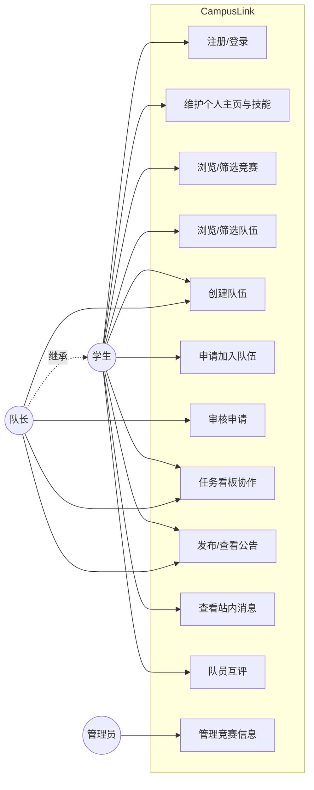

# CampusLink 需求分析说明书

> 校园竞赛组队与协作平台 —— 软件工程综合课程设计（第 6 组）

## 1. 项目背景

随着高校学科竞赛体系不断完善，大学生需要参与的赛事种类越来越多（ACM-ICPC、数学建模、蓝桥杯、"挑战杯"、"互联网+"、软件创新大赛等），课程设计、毕业设计、SRTP 也都要求组队完成。但跨班级、跨专业、跨年级的组队渠道极其有限，普遍存在以下问题：

- **信息不对称**：擅长后端的同学找不到前端 / UI 队友，反之亦然。
- **队员能力难以核实**：仅凭自我介绍难以判断真实水平与责任心。
- **缺少协作工具**：任务分配、进度跟踪、文件共享、消息通知分散在多个工具中。
- **缺少信誉沉淀**：历史责任心与能力没有可量化记录，每次组队都要"从零试探"。

## 2. 应用意义

构建一个集 **找队友 → 申请加入 → 组队成功 → 任务协作 → 比赛结束 → 队员互评** 于一体的闭环平台：

- 提升学生参赛积极性，降低组队门槛。
- 通过技能标签、专业、年级、信誉分多维匹配，提升组队质量。
- 集成轻量级看板与公告，降低对外部工具的依赖。
- 通过多维互评形成可量化信誉分，沉淀长期信誉。

## 3. 用户角色

| 角色 | 说明 | 主要权限 |
| --- | --- | --- |
| 学生（STUDENT） | 平台主要用户 | 浏览 / 创建 / 加入队伍、任务协作、互评 |
| 队长（LEADER） | 创建队伍后自动成为队长 | 审核申请、发布公告、管理任务与队伍 |
| 管理员（ADMIN） | 平台运营者 | 录入与管理竞赛信息、维护技能库 |

> 队长是一种"队伍内角色"，由 `team_member.role` 标识；学生 / 管理员是"系统角色"，由 `user.role` 标识。

## 4. 功能模块（8 大模块）

### 模块 1：用户模块
- 注册登录：账号密码注册，邮箱（可选）；登录后下发 JWT。
- 个人主页：昵称、专业、年级、头像、技能标签、项目经历、信誉分。
- 技能标签管理：从技能库添加 / 移除标签。

### 模块 2：竞赛模块
- 竞赛信息发布与浏览：管理员录入名称、简介、报名截止时间、类型。
- 学生按类型、时间筛选赛事，作为创建队伍的关联条件。

### 模块 3：队伍模块（系统核心）
- 创建队伍：队伍名称、关联竞赛、简介、需要总人数、招募岗位。
- 浏览队伍：列表展示简介、当前人数、缺口岗位。
- 多维筛选：按技能、比赛、学院、年级筛选。

### 模块 4：申请加入模块
- 学生提交申请：自我介绍、技能说明、个人主页链接。
- 队长审核：通过 / 拒绝并填写理由。
- 状态流转：待审核 → 已通过 / 已拒绝，结果以站内消息推送。

### 模块 5：队内协作模块
- 任务管理：标题、描述、截止时间、负责人。
- 看板视图：待办 / 进行中 / 已完成 三栏，拖拽更新状态。
- 进度可视化：状态分布柱状图。

### 模块 6：公告模块
- 队长发布公告（开会、阶段进展、比赛通知）。
- 成员查看历史公告，未读公告站内提醒。

### 模块 7：消息模块
- 站内消息中心：申请通知、审核结果、公告通知、任务指派通知。
- 已读 / 未读状态管理。

### 模块 8：评价系统
- 比赛结束后队员匿名互评。
- 评分维度：责任心、技术能力、沟通能力（各 1—5 分）。
- 加权汇总形成信誉分，展示在个人主页。

## 5. 用例图（Use Case）

## 6. 非功能性需求

- **安全性**：基于 JWT 的无状态鉴权 + Spring Security 角色权限控制；密码 BCrypt 加密存储。
- **性能**：列表接口分页（MyBatis Plus 分页插件）；热门队伍排行、未读消息计数可用 Redis 缓存（加分项）。
- **可用性**：响应式页面，Element Plus 统一风格。
- **可维护性**：前后端分离、统一返回体、统一异常处理、RESTful 接口约定。

## 7. 技术选型

| 层 | 技术 |
| --- | --- |
| 前端 | Vue 3 + Vite + Element Plus + Pinia + Vue Router + Axios |
| 后端 | Spring Boot + MyBatis Plus + Spring Security + JWT |
| 数据库 | MySQL 8.0 |
| 缓存（加分项） | Redis |
| 部署 | Nginx 反向代理 + 可选 Docker Compose |
