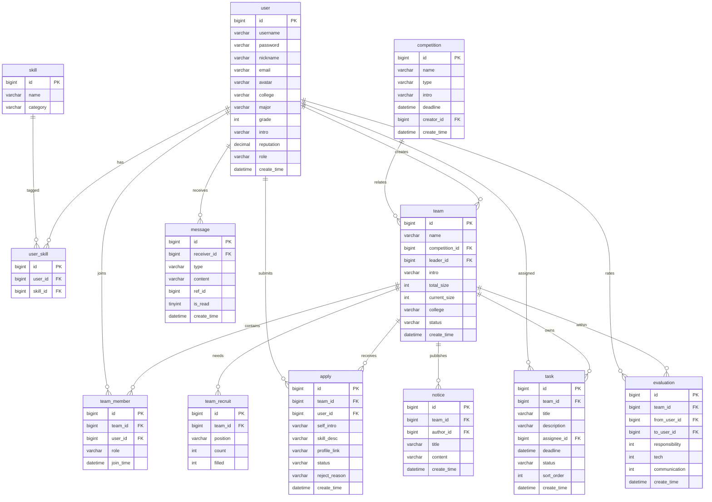

# CampusLink 数据库设计说明书

数据库：MySQL 8.0，字符集 `utf8mb4`，引擎 InnoDB。共 **12 张核心表**。

## 1. E-R 图



## 2. 表结构说明

### 2.1 user（用户表）
| 字段 | 类型 | 说明 |
| --- | --- | --- |
| id | bigint PK | 主键 |
| username | varchar(50) | 登录账号，唯一 |
| password | varchar(100) | BCrypt 加密密码 |
| nickname | varchar(50) | 昵称 |
| email | varchar(100) | 邮箱（可选） |
| avatar | varchar(255) | 头像 URL |
| college | varchar(50) | 学院 |
| major | varchar(50) | 专业 |
| grade | int | 年级（如 2023） |
| intro | varchar(500) | 个人简介 / 项目经历 |
| reputation | decimal(4,2) | 信誉分，默认 5.00 |
| role | varchar(20) | 系统角色 STUDENT / ADMIN |
| create_time | datetime | 注册时间 |

### 2.2 skill（技能库表）
| 字段 | 类型 | 说明 |
| --- | --- | --- |
| id | bigint PK | 主键 |
| name | varchar(50) | 技能名称，唯一（Java、Vue…） |
| category | varchar(20) | 分类（后端 / 前端 / 设计 / 算法…） |

### 2.3 user_skill（用户技能关联表）
| 字段 | 类型 | 说明 |
| --- | --- | --- |
| id | bigint PK | 主键 |
| user_id | bigint FK | 用户 |
| skill_id | bigint FK | 技能 |

### 2.4 competition（竞赛表）
| 字段 | 类型 | 说明 |
| --- | --- | --- |
| id | bigint PK | 主键 |
| name | varchar(100) | 竞赛名称 |
| type | varchar(20) | 类型：PROGRAM/MODELING/INNOVATION/COURSE |
| intro | varchar(1000) | 简介 |
| deadline | datetime | 报名截止时间 |
| creator_id | bigint FK | 录入管理员 |
| create_time | datetime | 创建时间 |

### 2.5 team（队伍表）
| 字段 | 类型 | 说明 |
| --- | --- | --- |
| id | bigint PK | 主键 |
| name | varchar(100) | 队伍名称 |
| competition_id | bigint FK | 关联竞赛 |
| leader_id | bigint FK | 队长 |
| intro | varchar(1000) | 队伍简介 |
| total_size | int | 需要总人数 |
| current_size | int | 当前人数 |
| college | varchar(50) | 队伍所属学院 |
| status | varchar(20) | RECRUITING / FULL / CLOSED |
| create_time | datetime | 创建时间 |

### 2.6 team_recruit（招募岗位表）
| 字段 | 类型 | 说明 |
| --- | --- | --- |
| id | bigint PK | 主键 |
| team_id | bigint FK | 队伍 |
| position | varchar(50) | 岗位（Vue 开发 / UI 设计…） |
| count | int | 需求人数 |
| filled | int | 已招人数 |

### 2.7 apply（申请表）
| 字段 | 类型 | 说明 |
| --- | --- | --- |
| id | bigint PK | 主键 |
| team_id | bigint FK | 申请的队伍 |
| user_id | bigint FK | 申请人 |
| self_intro | varchar(500) | 自我介绍 |
| skill_desc | varchar(500) | 技能说明 |
| profile_link | varchar(255) | 个人主页链接 |
| status | varchar(20) | PENDING / APPROVED / REJECTED |
| reject_reason | varchar(255) | 拒绝理由 |
| create_time | datetime | 申请时间 |

### 2.8 team_member（队伍成员表）
| 字段 | 类型 | 说明 |
| --- | --- | --- |
| id | bigint PK | 主键 |
| team_id | bigint FK | 队伍 |
| user_id | bigint FK | 成员 |
| role | varchar(20) | LEADER / MEMBER |
| join_time | datetime | 加入时间 |

### 2.9 task（任务表）
| 字段 | 类型 | 说明 |
| --- | --- | --- |
| id | bigint PK | 主键 |
| team_id | bigint FK | 所属队伍 |
| title | varchar(100) | 任务标题 |
| description | varchar(1000) | 任务描述 |
| assignee_id | bigint FK | 负责人 |
| deadline | datetime | 截止时间 |
| status | varchar(20) | TODO / DOING / DONE |
| sort_order | int | 看板内排序 |
| create_time | datetime | 创建时间 |

### 2.10 notice（公告表）
| 字段 | 类型 | 说明 |
| --- | --- | --- |
| id | bigint PK | 主键 |
| team_id | bigint FK | 所属队伍 |
| author_id | bigint FK | 发布者 |
| title | varchar(100) | 标题 |
| content | varchar(2000) | 内容 |
| create_time | datetime | 发布时间 |

### 2.11 message（站内消息表）
| 字段 | 类型 | 说明 |
| --- | --- | --- |
| id | bigint PK | 主键 |
| receiver_id | bigint FK | 接收人 |
| type | varchar(20) | APPLY/AUDIT/NOTICE/TASK |
| content | varchar(500) | 消息内容 |
| ref_id | bigint | 关联业务 id |
| is_read | tinyint | 0 未读 / 1 已读 |
| create_time | datetime | 时间 |

### 2.12 evaluation（互评表）
| 字段 | 类型 | 说明 |
| --- | --- | --- |
| id | bigint PK | 主键 |
| team_id | bigint FK | 所属队伍 |
| from_user_id | bigint FK | 评价人 |
| to_user_id | bigint FK | 被评价人 |
| responsibility | int | 责任心 1-5 |
| tech | int | 技术能力 1-5 |
| communication | int | 沟通能力 1-5 |
| create_time | datetime | 时间 |

## 3. 信誉分计算

被评价人信誉分采用加权平均（满分 5）：

```
单次得分 = 责任心 * 0.4 + 技术能力 * 0.35 + 沟通能力 * 0.25
信誉分   = (Σ 单次得分) / 评价条数
```

参赛次数越多置信度越高，可在汇总时结合评价条数做置信修正（见 Day9-10 实现）。
